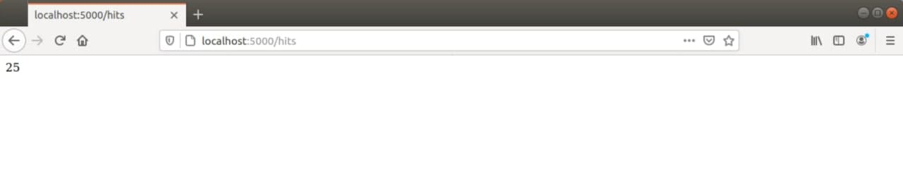
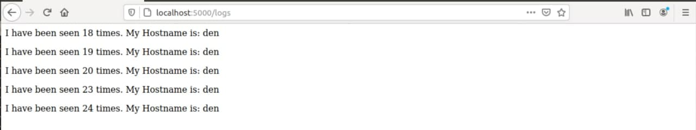
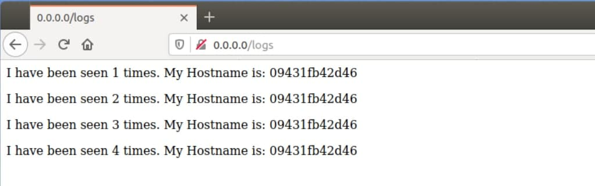

# lab 5
***
**1.** Прочитав все, що стосується "docker-compose" та бібліотеки "Flask".  
**2.** Створив папку "my_app" і папку "tests".  
**3.** Перевірив працездатність проекту за допомогою команд "pipenv --python 3.7", "pipenv install -r requirements.txt", "pipenv run python app.py".  
**4.** Виникли 2 помилки. Перша полягала у "redis-server" він не був встановлений і запущений, друга полягала у відсутності папки "Logs", створив вручну і все запрацювало.  
**5.** Провів тести за допомогою команди "pipenv run pytest test_app.py --url http://localhost:5000" всі вони пройшли успішно.
**6.** Перевірив роботу сайту та перейшов на всі його сторінки.
**7.** Очистив середовище, після чого створив два файла "Dockerfile.app" та "Dockerfile.tests", а також "Makefile" для автоматизації процесу.  
**8.** Описую кожну директиву "Makefile":  
- REPO - змінна для зберігання назви Docker репозиторію    
- PHONY - дозволяє оголошувати фальшиві цілі  
- STATES - змінна для зберігання директив  
- run - директива для створення мережі  
- test-app - директива для запуску контейнера з моніторингом  
- docker-prune - видалення контейнерів, волюмів, мереж i імеджів  
- $(STATES) - директива для білда самого контейнера  
- docker-delete - директива для видалення імелжів  
**9.** Скрішоти сторінок сайту:  
   
   
   
**10.** Завантажив імеджі до Docker Hub репозиторію: https://hub.docker.com/r/denysitis/labpy4/tags?page=1&ordering=last_updated  
***
**11.** Переходжу до Docker-compose, перевірив чи встановлений "Docker-compose" та запустив його за допомогою команди "docker-compose -p lab5 up"  
**12.** Веб-сайт працює, адреса для переходу на сайт - http:/0.0.0.0/  Скрішоти сторінок сайту:  
  
  
  
**13.** Компоуз створив докер імеджі, тег для цих імеджів "compose".  
**14.** Запушив імеджі до Docker Hub.  
**15.** "docker-compose" на мою думку краще використовувати для створення і запуску імеджів.  
**16.** Створив "docker-compose.yaml" для 4-тої лаборатоної роботи і запушив його до файлів 4-тої роботи.
***